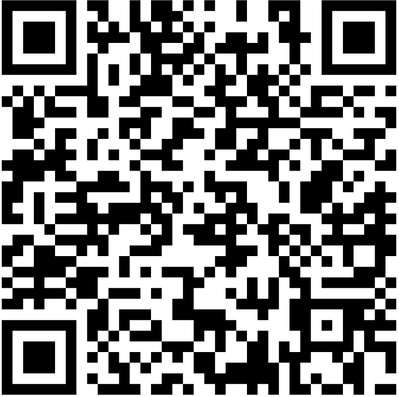
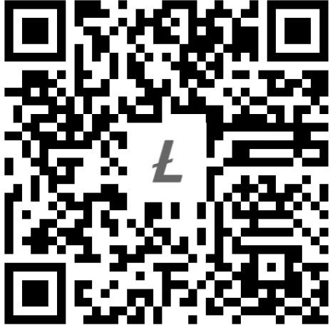
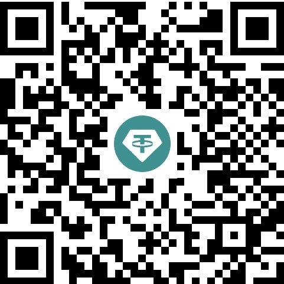

<div align="center">

<h1>🔍 CapSnap</h1>

<p><strong>A pure-Python CAPTCHA solver & OCR engine — built from scratch, zero dependencies</strong></p>

[](https://pypi.org/project/capsnap/)
[](https://pypi.org/project/capsnap/)
[](LICENSE)
[](https://github.com/anbuinfosec/capsnap/actions/workflows/ci.yml)
[](https://pypi.org/project/capsnap/)

> **No Tesseract. No OpenCV. No NumPy. No Pillow. Just Python.**

</div>

---

## 🤔 What is CapSnap?

**CapSnap** is a production-quality **CAPTCHA solver and OCR engine** written entirely in the Python standard library with **zero external dependencies**. It implements every component from scratch:

- 📦 Custom PNG decoder
- 🖼️ Grayscale conversion & Otsu's binarization
- 🔗 Connected-component labeling for character isolation
- 🧠 Multi-Layer Perceptron (MLP) neural network — trained on real CAPTCHA images
- ✂️ 5-way forced vertical slicing for noisy CAPTCHAs

It ships with a **pre-trained model** specifically tuned for noisy, handwritten-style CAPTCHA characters used by real-world websites — and it can be retrained on any new CAPTCHA style in minutes.

---

## ✨ Key Features

| Feature | Details |
|---|---|
| 🚫 **Zero dependencies** | Pure Python standard library only — nothing to `pip install` |
| 🔓 **CAPTCHA solver** | Built-in mode for 4–5 character noisy CAPTCHAs |
| 🧠 **Neural network OCR** | Custom MLP with ReLU hidden layer and softmax output |
| 📸 **Universal input** | File path, `pathlib.Path`, raw bytes, or base64 data-URL |
| 🏋️ **Self-trainable** | Retrain on any CAPTCHA dataset — answers extracted from API tokens automatically |
| 🖥️ **CLI included** | `capsnap captcha.png` works out of the box |
| ⚡ **Lightweight** | < 2 MB installed, starts instantly, no warmup |
| 🔒 **Privacy-first** | Runs 100% locally — no API calls, no cloud, no data leaks |

---

## 📦 Installation

```bash
pip install capsnap
```

No extra dependencies. No system libraries. Works on Python **3.11+**.

---

## 🚀 Quick Start — CAPTCHA Solving

```python
from capsnap import OCR

# Initialize in CAPTCHA mode
ocr = OCR(mode="captcha")

# Solve from a file path
result = ocr.read("captcha.png")
print(result.text)        # e.g. "RF3rH"
print(result.confidence)  # e.g. 0.923
```

### Feed it anything

```python
# From a URL / API response (base64 data-URL)
result = ocr.read("data:image/png;base64,iVBORw0KGgo...")

# From raw bytes (e.g. requests response)
import urllib.request
with urllib.request.urlopen("https://example.com/captcha") as r:
    result = ocr.read(r.read())

# From a pathlib.Path
from pathlib import Path
result = ocr.read(Path("captcha.png"))
```

### Full example — solve a live CAPTCHA from an API

```python
import json
import urllib.request
import base64
from capsnap import OCR

url = "https://example.com/api/captcha"
req = urllib.request.Request(url, headers={"accept": "application/json"})
with urllib.request.urlopen(req) as response:
    data = json.loads(response.read().decode())

# Pass the base64 image directly to CapSnap
ocr = OCR(mode="captcha")
result = ocr.read(data["image"])  # data:image/png;base64,...
print(result.text)
```

---

## 🖥️ CLI Usage

```bash
# Solve a CAPTCHA image
capsnap --mode captcha captcha.png

# Standard document OCR
capsnap document.png
```

---

## 🔄 All Input Methods

```python
from capsnap import OCR
ocr = OCR(mode="captcha")

ocr.read("captcha.png")                    # file path string
ocr.read(Path("captcha.png"))              # pathlib.Path
ocr.read(open("captcha.png", "rb").read()) # raw bytes
ocr.read("data:image/png;base64,...")      # base64 data-URL

# Explicit methods still available
ocr.read_path("captcha.png")
ocr.read_bytes(raw_bytes)
ocr.read_base64(b64_string)
```

---

## 🏗️ Architecture

```
Input (path / bytes / base64)
          │
          ▼
   ┌─────────────┐
   │ PNG Decoder │ ← pure Python, no Pillow
   └──────┬──────┘
          │
          ▼
   ┌─────────────┐
   │  Grayscale  │ ← luminance-weighted conversion
   └──────┬──────┘
          │
          ▼
   ┌─────────────┐
   │    Otsu     │ ← auto threshold binarization
   └──────┬──────┘
          │
     ┌────┴─────────────────────┐
     │ CAPTCHA mode             │ Document mode
     │ 5-way vertical slicing   │ Connected-component labeling
     └────────────┬─────────────┘
                  │
                  ▼
         ┌──────────────┐
         │ Feature Ext. │ ← normalized 20×20 patch
         └──────┬───────┘
                │
                ▼
         ┌──────────────┐
         │  MLP Network │ ← ReLU hidden → Softmax output
         └──────┬───────┘
                │
                ▼
          OCRResult
       (text, confidence)
```

---

## 🎯 Retraining on Any CAPTCHA

CapSnap can retrain its neural network on any CAPTCHA style automatically if the API exposes the answer in the response token. No manual labeling needed:

```bash
# Fetch 1000 real CAPTCHAs and retrain the model
PYTHONPATH=. python tools/train_from_tokens.py
```

The training script:
1. Fetches live CAPTCHAs from the target API
2. Decodes the correct answer from the API's JWT/token
3. Extracts and normalizes character patches
4. Trains the MLP for 100 epochs
5. Saves the updated `capsnap/model.capsnap` automatically

---

## 📁 Project Structure

```
capsnap/
├── capsnap/               ← installable package
│   ├── api.py             ← OCR class (universal entry point)
│   ├── model.py           ← MLP neural network (pure Python)
│   ├── model.capsnap      ← pre-trained weights (bundled)
│   ├── recognize.py       ← character recognition
│   ├── decoder/           ← pure-Python PNG decoder
│   ├── components.py      ← connected-component labeling
│   ├── features.py        ← patch extraction + resize
│   ├── grayscale.py       ← RGB → grayscale
│   ├── threshold.py       ← Otsu's binarization
│   ├── morphology.py      ← noise removal
│   ├── segmentation.py    ← line/word grouping
│   └── cli.py             ← CLI entry point
├── tests/                 ← offline unit tests
├── examples/              ← usage examples
├── assets/                ← images & donation QR codes
└── .github/workflows/     ← CI + auto-publish to PyPI
```

---

## 🧪 Testing

```bash
pip install -e ".[dev]"
pytest tests/ -v
```

All 8 tests run **offline** — no network, no API calls required.

---

## 💖 Support & Donations

CapSnap is free and open-source. If it saved you time, helped bypass a pesky CAPTCHA, or powered your project, consider buying me a coffee! ☕

<div align="center">

### 🇧🇩 bKash / Nagad / Rocket (Bangladesh)



---

### 💎 Telegram Stars / TON (Gram)


---

### 🪙 Litecoin (LTC)



---

### 💵 USDT (BEP20)



---

Every contribution — big or small — keeps this project alive. Thank you! 🙏

</div>

---

## 📄 License

MIT License — see [LICENSE](LICENSE) for details.

---

<div align="center">
Made with ❤️ by <a href="https://github.com/anbuinfosec">@anbuinfosec</a> · Pure Python · Zero Dependencies
</div>